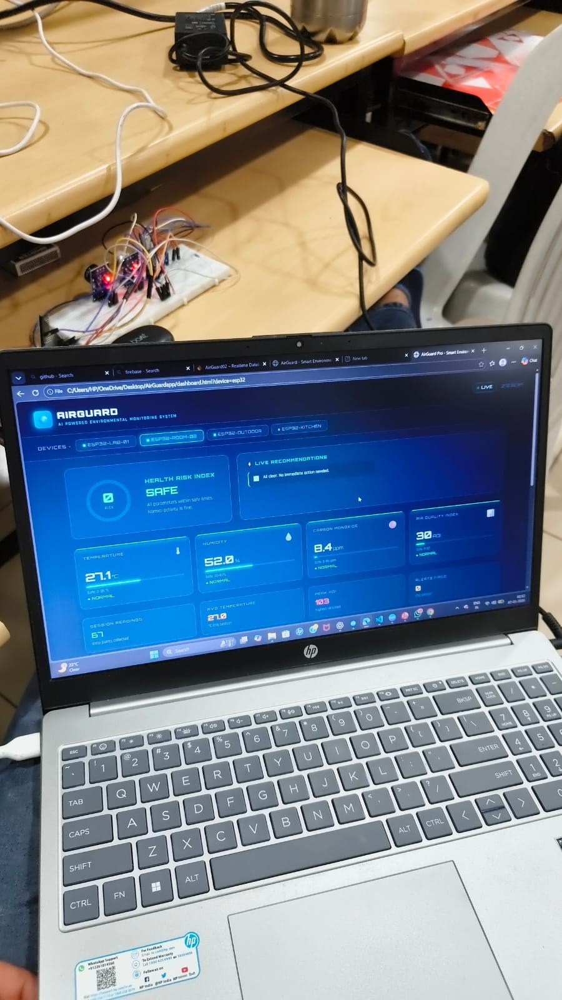
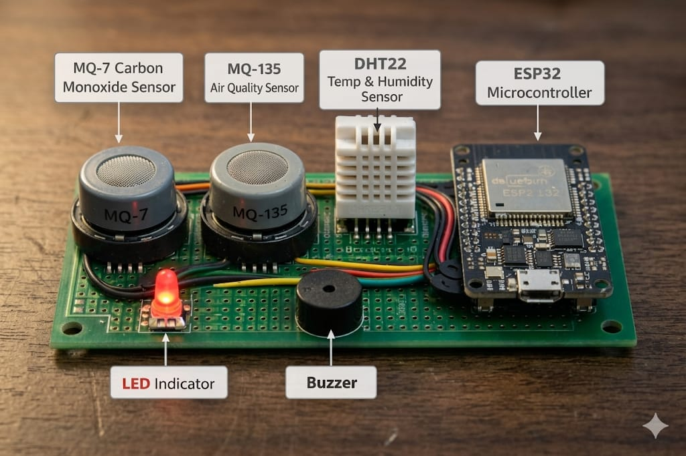
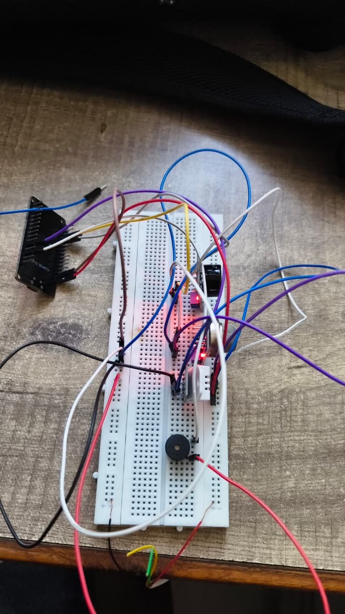
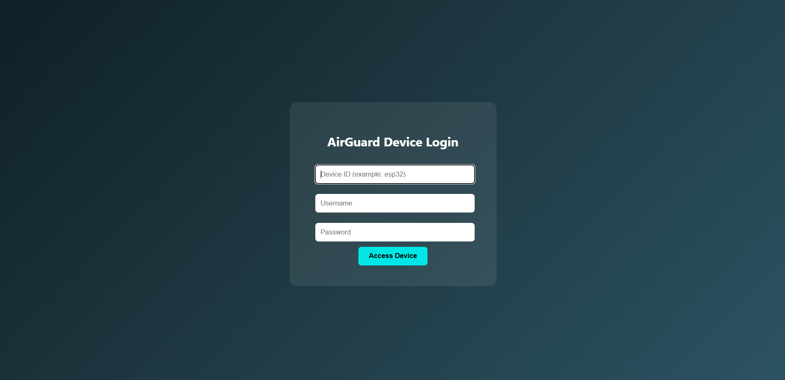
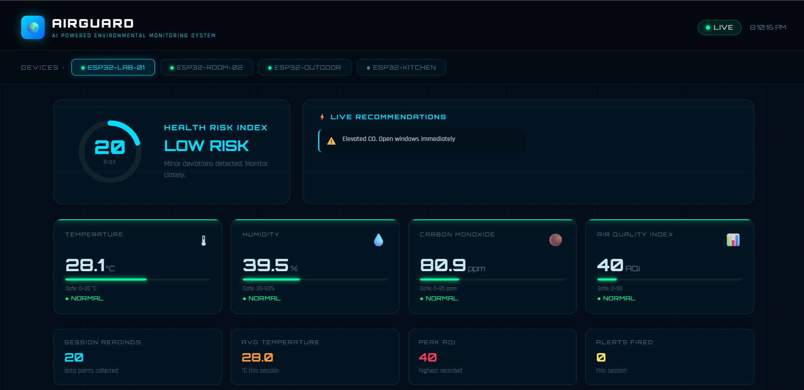
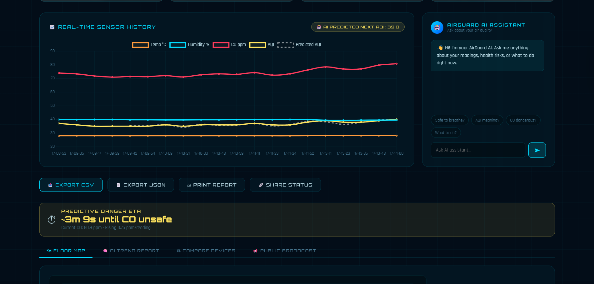
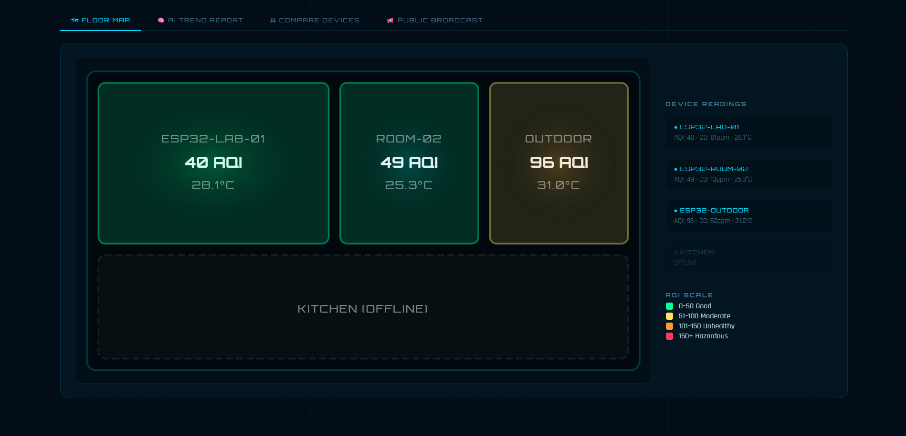
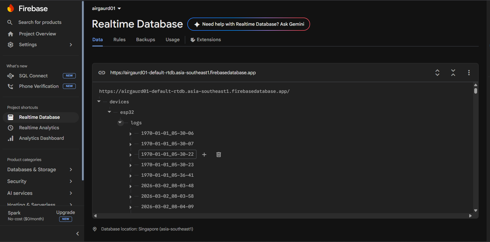

# 🌍 AirGuard - IoT Air Monitoring System

An ESP32-based IoT Air Monitoring System that continuously monitors environmental conditions and air quality using multiple sensors. The collected data is transmitted to Firebase Realtime Database and displayed through a web dashboard for real-time monitoring.

---

# 📖 Project Overview

AirGuard is a smart environmental monitoring system designed to measure air quality, temperature, humidity, and gas concentration levels in real time.

The system uses an ESP32 microcontroller connected to multiple sensors. Sensor data is uploaded to Firebase Realtime Database and displayed through a web-based dashboard that can be accessed remotely.

This project demonstrates the integration of:

* Embedded Systems
* Internet of Things (IoT)
* Cloud Database
* Web Development
* Real-Time Monitoring

---

# 🎯 Objective

To develop a low-cost IoT-based environmental monitoring solution capable of collecting sensor data, storing it in the cloud, and displaying it through a real-time web dashboard.

---

# 🔧 Hardware Components Used

| Component        | Purpose                             |
| ---------------- | ----------------------------------- |
| ESP32            | Main Microcontroller                |
| MQ7 Sensor       | Carbon Monoxide Detection           |
| MQ13 Sensor      | Gas Detection                       |
| DHT22            | Temperature and Humidity Monitoring |
| Breadboard       | Circuit Prototyping                 |
| Jumper Wires     | Connections                         |
| USB Power Supply | Power Source                        |

---

# 💻 Software Technologies Used

| Technology                 | Purpose                 |
| -------------------------- | ----------------------- |
| Arduino IDE                | ESP32 Programming       |
| Firebase Realtime Database | Cloud Data Storage      |
| HTML                       | Web Dashboard Structure |
| CSS                        | Dashboard Styling       |
| JavaScript                 | Dashboard Functionality |
| GitHub                     | Project Documentation   |

---

# ✨ Features

* Real-Time Air Quality Monitoring
* Temperature Monitoring
* Humidity Monitoring
* Firebase Realtime Database Integration
* Live Web Dashboard
* Wireless Data Transmission
* Cloud Data Storage
* Remote Monitoring

---

# 🏗️ System Architecture

```text
MQ7 Sensor
      \
       \
MQ13 Sensor -----> ESP32 -----> Firebase Realtime Database -----> Web Dashboard
       /
      /
DHT22 Sensor
```

---

# 🔄 Working Principle

1. Sensors collect environmental data.
2. ESP32 reads sensor values.
3. Data is transmitted through Wi-Fi.
4. Firebase stores the sensor readings.
5. Dashboard fetches data from Firebase.
6. Users can monitor the environment in real time.

---

# 📸 Complete Hardware Setup



---

# 🔌 Components Used



---

# 🛠 Real Hardware Implementation



---

# 📊 Dashboard Screenshots

### Dashboard Login Page



### Environmental Monitoring Dashboard



### Live Sensor Data Display



### Device Monitoring Interface



---

# 🔥 Firebase Realtime Database

The ESP32 uploads sensor readings directly to Firebase Realtime Database where the data is stored and synchronized in real time.



---

# 📂 Repository Structure

```text
AirGuard
│
├── README.md
├── index.html
├── dashboard.html
├── esp32_code
│
└── image
    ├── dashboard_01.png
    ├── dashboard_02.png
    ├── dashboard_03.png
    ├── dashboard_04.png
    ├── firebase_database.png
    ├── hardware_used.jpeg
    ├── real_hardware.jpeg
    └── whole_setup.jpeg
```

---

# ⚠ Challenges Faced

* Sensor calibration and testing
* Stable Wi-Fi communication
* Firebase data synchronization
* Dashboard design and responsiveness
* Real-time data handling

---

# 🚀 Future Improvements

* Mobile Application Support
* Email and SMS Alerts
* AI-Based Air Quality Prediction
* Historical Data Analysis
* Multi-Device Monitoring
* GPS Integration
* Advanced Sensor Calibration

---

# 📈 Results

The AirGuard system successfully collected environmental data using MQ7, MQ13, and DHT22 sensors. Data was transmitted to Firebase Realtime Database and displayed through a web dashboard in real time. The project demonstrates a complete IoT monitoring pipeline from sensor acquisition to cloud storage and user visualization.

---

# 👨‍💻 Developer

**Rutansh Panchal**

Electronics Engineering Student

Interested in:

* Embedded Systems
* Internet of Things (IoT)
* Robotics
* ESP32 Development
* Cloud Connected Devices
* Electronics Product Design

---

⭐ If you found this project interesting, consider giving it a star.

